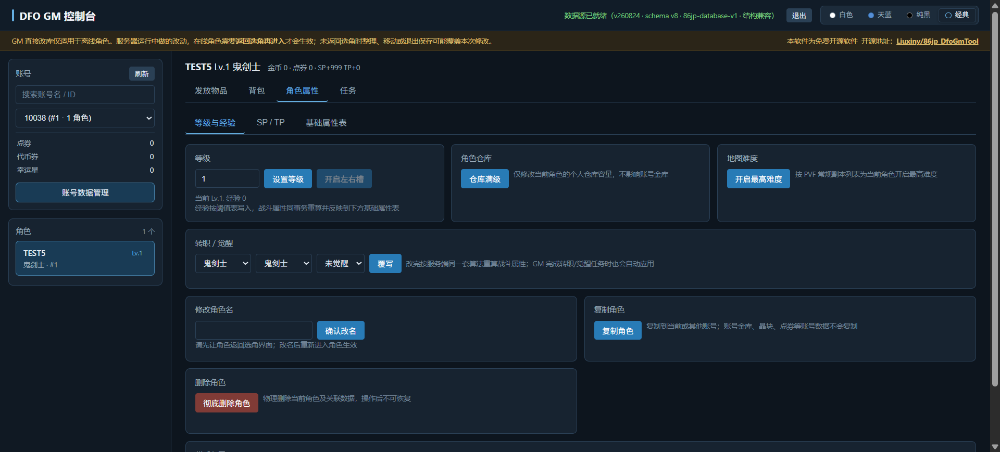

# DfoGmTool

> S4A21 (86jp) 服务端的 Web GM 控制台 — 基于 [rewio/DfoGmTool](https://codeberg.org/rewio/DfoGmTool) 深度重构
> 
> 当前发布版 **v260824** · 对齐 S4A21 服务端、数据库结构示例 **schema v8** · MIT License

独立进程运行，读取服务端部署目录里的 `inventory.db` 和 `Script.pvf`；浏览器打开 `http://localhost:5050` 即可使用。发放页默认“邮件发放”，搜索框左侧的单按钮可切换“邮件发放/背包发放”并记忆选择；从邮件切入背包只在该次切换确认一次，刷新恢复已记忆的背包模式不再提示，也没有常驻警告，列表和配置提交文案会随模式更新。请求缺失、空白或未知的 `deliveryMode` 安全回退为邮件。邮件模式下普通装备、装扮、宠物、消耗品、晶块和复活币通过系统邮件发放；背包模式下普通物品复用新版背包直写，晶块直充账号共享状态，复活币直充角色虚拟钱包，容量不足会整体失败回滚。名称装饰卡始终直写 `character_name_tag_state`，`PremiumCatalog` 契约始终直写账号契约状态，不受模式切换影响。邮件项目关闭并重新打开邮箱即可，背包和专用直发项目通常需重新选择角色刷新。其他管理功能继续使用经过结构兼容门禁的数据库服务。源码自包含，不依赖任何本地相邻仓库即可构建和发布。

🔗 **仓库地址**

| 平台       | 地址                                            |
| -------- | --------------------------------------------- |
| Codeberg | <https://codeberg.org/Liuxiny/86jp_DfoGmTool> |
| GitHub   | <https://github.com/Liuxiny/86jp_DfoGmTool>   |
| 上游原版     | <https://codeberg.org/rewio/DfoGmTool>        |

---

## 界面预览

### 发放物品

**装备发放** — 分类树 + 关键词/等级/品质/可用职业多维筛选，名称按品级着色，装备在配置卡片中设置强化/增幅/锻造/红字后确认发放：


**宠物 / 名称装饰卡** — 宠物与名称装饰卡独立分类：


**装扮** — 按当前角色职业过滤可用装扮，上衣/下装等部位属性和技能在配置卡片中选择：


**消耗品 / 材料** — 可叠加物品按背包六段分类，直接输入数量发放：


**期限道具** — 期限类道具独立筛选，在配置卡片中设置期限天数后确认发放：


### 背包管理

**装备页** — 按容器分类查看，可配置装备显示「配置」按钮，点击弹出浮动配置卡片修改强化/增幅/锻造/红字，直接更新新版 `ItemCore` 对应字段，不破坏附魔、徽章、异界属性等数据：


**装扮页** — 可配置装扮显示「配置」按钮，修改部位属性/上衣技能，并保持新版装扮明细与 `ItemCore` 引用一致：


### 角色属性

**等级与转职** — 等级设置与经验阈值联动并重算战斗属性；转职/觉醒通过 PVF 校验后写入，自动重建技能列表、清理旧职业残留、同步转职任务状态：


**技能点** — SP/TP 真实剩余/总量查看（区分技能方案页），附加点调整带合法性校验，一键剩余归零：


### 修改角色名

输入新名后实时检查可用性，确认后在单事务内同时写入 `name` 与 `name_bytes`。角色名按 A21 客户端语义使用 GBK(936) 编码，长度校验按字节计（2–18 字节），查重同时比对 GBK 字节、字符串和历史 UTF-8 写入三种形态，避免中文名乱码或重名漏判：



### 任务系统

**全部可见任务** — 按区域分组展示当前等级可见的全部任务，支持一键完成当前等级的主线/支线/系统任务/无需物品的成就任务：


**任务库搜索** — 按类型（主线/普通/每日/重复/成就）和区域过滤，关键词和 ID 搜索：


**成就与称号簿** — 称号集合按称号簿五页分类，一键称号簿批量完成全部未完成成就，支持批量取消已完成成就：


### 数据迁移

**S4A12 → S4A21** — 复用当前数据库与 A21 PVF 路径，先预览源识别、数据量、可迁移/跳过项目和 PVF 排除清单，再勾选备份确认并输入确认词执行；执行在临时库校验通过后才替换原文件：


---

## 上游 S4A21GmTool 功能对齐

以下功能来自上游 [rewio/S4A21GmTool](https://gitgud.io/rewio/S4A21GmTool)，本项目按自身数据与前端约定重新实现，不是代码直搬：

- **物品图标与悬浮预览**：`config.ini` 的 `imagepacks_path`（或数据源面板的 ImagePacks2 输入框）指向客户端 `ImagePacks2` 目录后，发放页、背包、账号金库、晶块/灵魂和邮件附件的物品名旁显示 28×28 图标，悬停 160ms 弹出游戏风格预览卡（PVF 说明文本、`{#TRED}` 等颜色码、属性行、期限、套装信息）。图标与边框素材直接从 NPK 解出并编码为 PNG（`ImagePack/`，无第三方图像库）。**未配置或路径无效时 `/api/items/{id}/icon` 返回 204，列表自动退化为纯文字**，不影响任何功能。改完路径无需重新加载数据源，只换图标目录时后端不重建 PVF 索引，前端原地补图。
- **套装信息与整套发放**：预览卡显示套装名、成套部件（带图标）和各件数加成；发放页的装备配置卡在可解析成套部件时出现「整套发放」勾选框，勾选后按套装成员各发 1 件到邮箱（每个部件固定 1 件，2–20 件，分片后最多两封邮件）。整套发放只支持邮件发放，背包模式下该勾选框禁用。套装成员按角色职业过滤，戒指不能锻造、防具不能加红字这类部件差异会**逐级回退到该部件支持的配置**而不是整套失败，响应里 `adjustedItems` 明确列出被调整的部件并在提示中说明。整套发放与单件发放共用请求编号幂等与回放检测，但 `request_hash` 使用独立输入格式，不影响已在邮箱里的单件请求。
- **副职业**：角色页读写副职业类型（附魔师/分解师/控偶师/炼金术师）与等级/经验，一键满级；经验与等级按 PVF 阈值互算，写入不触碰普通/PVP 技能状态。
- **角色邮箱查看与管理**：新增「邮箱」页，列出当前角色全部收件箱与保管邮件（GM 视角不做过期清理），显示发件人、标题、金币与附件（附件名同样带图标与悬浮预览）、领取状态、folder 与已读状态；支持单封删除和整箱清空，两者都是物理删除语义——未领附件随邮件消失，不会退回背包。
- **本机文件选择框**：数据源面板的数据库、PVF、ImagePacks2 三个路径旁各有「浏览…」按钮，由后端弹出 Windows `IFileOpenDialog`（文件/目录两种模式，按当前输入值定位初始目录）。浏览器拿不到真实磁盘路径，所以只能由后端弹窗。**远程模式下该端点直接拒绝**，非 Windows 返回提示要求手填。

> 以上五项目前只做过构建与静态检查，尚未纳入 `SelfTests/` 的自测用例；整套发放的邮件分片与幂等复用已覆盖的系统邮件路径，图标/预览/文件框都是只读或纯展示逻辑。

---

## v260824 S4A21 服务端兼容更新


- **结构兼容门禁**：GM 只读检查数据库结构，不要求 `PRAGMA user_version` 与工具版本相等；空库、缺失 A21 必需表/列或关键 `item_core` 不是 99 字节时拒绝加载。A21 schema v8 可直接作为结构基线示例。A12 迁移要求 `accounts`、`characters`、角色物品清单三类核心同时兼容；`character_items`/`character_new_items` 至少一种存在，库中存在且参与迁移的角色物品表均须满足核心列，额外列允许，账号仓库和穿戴表作为可选补充；任务等非核心表不强制。
- **A21 背包语义**：角色物品使用 `character_inventory_items`，账号仓库使用 `account_inventory_items`，审计写入 `inventory_audit_log`；`ItemCore` 保留 99 字节尾部数据，勋章/守护珠使用列表类型 38 的 0–48/49–97 槽位。
- **服务端契约同步**：`sync-server-contracts.ps1` 默认同步 S4A21 的 schema、PvfLib、任务契约及 PVF 源锚点，manifest 记录 baseline、schema/hash 与同步清单；A21 已原生兼容的包头不再应用旧补丁。
- **备份格式**：当前账号备份为 v3；恢复前校验 A21 结构和 99 字节 `ItemCore`，GM 日常运行仍不会隐式创建或升级数据库。
- **发布真源**：API 与前端就绪状态显示工具版本 `v260824`。

## v260809 服务端兼容更新

- **物品交付边界**：发放页默认邮件，可在搜索框左侧用单按钮切换背包发放；从邮件切入背包仅该次切换确认一次，刷新恢复背包模式不再提示且没有常驻警告，列表/配置提交文案随模式变化。缺失、空白或未知 `deliveryMode` 均安全回退邮件。邮件模式下普通装备、装扮、宠物、消耗品、晶块和复活币走新版系统邮件与附件，背包模式下普通物品复用新版背包直写、晶块直充账号共享状态、复活币直充角色虚拟钱包；背包容量不足整体失败回滚。名称装饰卡始终直写 `character_name_tag_state`，`PremiumCatalog` 契约始终直写账号契约状态，不受模式切换影响。
- **高级属性完整保留**：品级、强化、增幅、锻造、时限、装扮属性和手工类型提示由 GM 使用同步的服务端/PVF 规则校验；邮件模式编码为服务端可直接领取的 `ItemCore` 附件，背包模式复用同一校验后写入新版 `ItemCore`。
- **明确的刷新边界**：GM 是独立进程，无法安全访问服务端在线会话内存，因此不会推送新邮件浮标或刷新已经打开的邮箱；新版服务端会在每次打开邮箱时重新查询邮件表，所以邮件发放后在线角色关闭并重新打开邮箱即可领取，不需要重新选择角色。背包直发以及名称装饰卡、契约直写状态通常需要重新选择角色刷新。
- **邮件堆叠与事务边界**：邮件模式下堆叠物品按当前 PVF 的 stack limit 拆成附件，每封最多 10 个附件；单次最多 10 封、100 个附件。整批邮件在一个 SQLite IMMEDIATE 事务中原子提交并持久化幂等；超过上限会明确拒绝，不会部分发放。背包模式复用新版背包写入，不宣称邮件式跨重启持久幂等。
- **当前角色清空邮箱**：发放页的“清空邮箱”只删除当前角色的 folder=0 收件人；共享邮件仍保留，只有不再被任何收件人引用的根消息、附件和对应系统审计才会清理。
- **异常物品维护**：账号数据管理的“异常物品清理”页在发现异常时显示顶部快捷按钮。它按当前 PVF 扫描所有账号的 `character_inventory_items` 与 `account_inventory_items`，排除主背包虚拟货币槽、邮箱和称号簿；清理前会重新扫描，并在单一事务中整体提交或回滚。
- **重复提交保护**：浏览器为一次操作生成稳定请求编号并在请求期间锁定发放控件；邮件模式的邮箱事务持久化幂等，相同请求重试返回原邮件，同编号不同内容会被拒绝。背包模式不宣称邮件式跨重启持久幂等，成功提示以服务端 `delivery` 为准。
- **任务 activation 契约**：进行中任务读取并返回 `activation_id/version`；标记可交使用带 activation 的 CAS，重复激活同一任务会生成新的运行身份，旧事件不会污染新任务运行。
- **任务契约可复现同步**：`ActiveQuest`、`QuestRepository`、`QuestSlotLayout` 与 schema、PvfLib 一同从服务端实际 HEAD 同步并记录哈希；每日任务使用最新版 30 个固定进行中槽位。
- **普通/PVP 技能隔离**：转职、觉醒、SP/TP 只重建普通技能方案，不清空或改写 A21 独立 PVP 技能状态。
- **账号级地下城难度**：一键解锁写入最新版 `account_dungeon_permissions`，同账号角色共享，重复执行幂等；不会再清空角色专属的安图恩等机制记录。
- **额外装备槽 bitmask**：状态 `7` 正确识别为左右槽与附加槽均已开启，角色详情、任务残留和前端按钮使用一致的位判断。

## v260729 历史更新

- **修复新版服务端复制角色回滚**：适配新增的 `dungeon_persistent_effect_outbox`，不再因其事件唯一索引不含角色归属列而中止整个复制事务。
- **隔离运行时事务账本**：动态复制仅自动接纳 `character_*` 角色自有状态表；副本效果 outbox、佣兵奖励 outbox、任务事件 inbox、审计与投递状态不会随角色复制，避免事件身份冲突或奖励重复执行。
- **保留复制安全校验**：没有放宽唯一索引保护；真正的角色状态表仍会检查主键、唯一索引和角色归属列，发现不安全结构时继续回滚。
- **补充回归覆盖**：新增三类运行时账本隔离用例，并验证普通动态角色状态表、全部复制选项与连续复制仍然正常。

## v260725_v1.1 历史更新

- **完善新版背包校验**：物品按角色真实开放容量写入对应 A21 区间，不沿用旧槽位编号或写入未开放格子。
- **修复复制角色错误**：复制时重建角色槽位、物品 UID、装扮 UID、宠物 UID 与关联明细；带职业限制的穿戴物自动放入合法 A21 容器，避免复制角色进入客户端后卡死或闪退。
- **统一背包位置判定**：角色复制、物品发放和背包配置统一使用 99 字节 `ItemCore` 类型与角色实际扩展状态校验。
- **账号备份格式 v3**：覆盖 A21 副职业、任务 activation、账号抽奖、独立 PVP 技能，以及邮箱消息/收件人/附件/系统审计和佣兵奖励明细关系；损坏或未来结构会明确拒绝。
- **安全恢复与删除**：账号还原会重建角色槽位，并重映射冲突的装扮、宠物、邮箱消息及审计编号；永久删除会拒绝仍在佣兵出战或奖励邮件尚未投递的角色，只清理已投递的历史奖励。
- **复制选项严格隔离**：A21 PVP 技能只属于“技能”，副职业只属于“其他”，任务 activation 可复制但事件 inbox 不复制；未登记的 `character_*` 表默认忽略，不动态猜测或复制。

## v260725 历史更新

- **适配 07-24 新版背包架构**：发放、背包查看与整理、装备/装扮配置、角色货币、账号货币、金币、晶块、复活币、账号金库、角色复制、账号备份和称号簿全部切换到新版 `ItemCore` 数据语义，不再保留旧版背包业务兼容路径。
- **A21 数据一致性**：角色、账号仓库、称号簿与名称装饰卡均按服务端现行结构处理，冲突时以结构校验结果为准。
- **称号簿与名称装饰卡**：新版称号簿按每个称号一条数据处理；冲突时以目标侧为准并清理来源侧，不作为满包残余保留。
- **刷新提示**：名称装饰卡和 `PremiumCatalog` 契约是直写专用状态，发放后角色通常必须返回选角并重新进入；邮件发放只需打开或重新打开邮箱，背包直发通常也需返回选角刷新。

## 相较上游的实际代码变更

本版本在上游 [rewio/DfoGmTool](https://codeberg.org/rewio/DfoGmTool) 基础上进行了深度重构。以下所有变更均基于新旧代码的逐文件对比，非概述性描述。

### 新增服务文件（16 个全新模块）

| 文件                                    | 行数  | 功能                                                                                                                                                            |
| ------------------------------------- | --- | ------------------------------------------------------------------------------------------------------------------------------------------------------------- |
| `GmService.AccountBackup.cs`          | 1281 | 完整账号备份与还原 — 遍历数据库全部关联表（30+ 张表按依赖顺序），导出账号及其角色的所有数据为 JSON，还原时处理外键约束、宠物句柄冲突、角色槽位索引重建、已废弃表兼容                                                                      |
| `GmService.CharacterClone.cs`         | 1010 | 角色复制 — 25 个可选复制类别（背包各分区、装备、装扮、宠物、技能、任务、称号簿、每日/周常、地图难度等），支持跨账号复制、新建目标账号（MD5 密码）、宠物句柄重映射、主键冲突规避                                                                 |
| `GmService.CharacterFixes.cs`         | 376 | 转职/觉醒重写 — `SetGrowTypeFixed` 增加 PVF 校验 (`TryValidateJobGrowOption`)、等级前置检查、转职后技能列表重建 (`CharacterSkillProfile.BuildSnapshot`) 或觉醒技能合并 (`MergeGrants`)、转职任务状态同步 |
| `GmService.CharacterRename.cs`        | 80  | 角色改名 — 按 A21 客户端语义使用 GBK(936) 编码，长度按字节校验（2–18 字节），单事务同时写 `name` 与 `name_bytes`，查重覆盖 GBK 字节 / 字符串 / 历史 UTF-8 写入三种形态                                             |
| `GmService.CharacterSpTp.cs`          | 225 | SP/TP 管理 — `AdjustSpTpSynced` 每次调整后同步技能点状态（区分双技能方案页），调整前校验负数保护；新增 `ZeroRemainingSpTp` 一键归零                                                                    |
| `GmService.InventoryConfiguration.cs` | 541 | 背包物品在线配置 — 直接修改新版 `ItemCore` 的强化、增幅、锻造、红字、品级、期限与装扮能力字段，并维护装扮明细引用                                                                                              |
| `GmService.InventoryAnomalies.cs`     | 432 | 全账号异常物品扫描与清理 — 按当前 PVF 合法 ID 集扫描 `character_inventory_items` 与 `account_inventory_items`，排除主背包虚拟货币槽、邮箱和称号簿；清理前重新扫描，单事务整体提交或回滚                                  |
| `GmService.Mailbox.cs`                | 442 | 角色邮箱查看与清理 — GM 视角列出全部收件箱/保管邮件（不做过期清理），单封删除与整箱清空都是物理删除；只删除该角色 `folder=0` 的收件人记录，保留共享邮件，仅清理不再被任何收件人引用的根消息、附件与系统审计                                    |
| `GmSystemMailService.cs`              | 859 | 系统邮件发放 — 堆叠附件按当前 PVF stack limit 拆分，每封最多 10 个附件、单次最多 10 封/100 附件，整批在单个 SQLite IMMEDIATE 事务内原子提交并按 `requestId` 持久化幂等；整套发放共用分片与幂等逻辑，`request_hash` 使用独立输入格式  |
| `GmService.ExpertJob.cs`              | 54  | 副职业读写入口（类型/等级/经验、一键满级），实际逻辑在 `ExpertJobProgressService`                                                                                                     |
| `ExpertJobProgressService.cs`         | 551 | 副职业进度 — 类型切换、等级与经验按 PVF 阈值互算后写入，不触碰普通/PVP 技能状态                                                                                                            |
| `ExpertJobPvfData.cs`                 | 271 | 副职业 PVF 数据（职业名、等级经验阈值）                                                                                                                                    |
| `PvfIndexService.Preview.cs`          | 277 | 物品悬浮预览数据 — 名称、品级、类型、需求等级、可用职业、说明/详细说明/风味文本、期限与套装引用                                                                                                      |
| `PvfIndexService.PreviewStats.cs`     | 936 | 预览属性行解析 — 从 PVF 装备/装扮/堆叠物数据还原客户端风格的属性文本，原样保留 `{#TRED}` 等颜色码交给前端渲染                                                                                        |
| `PvfIndexService.Sets.cs`             | 482 | 套装解析 — 按 `part set index` 归组成员、套装名与各件数加成，以及整套可发性判定（2–20 件、按角色职业过滤）                                                                                        |
| `PvfIndexService.Dungeons.cs`         | 76  | 地下城权限数据读取                                                                                                                                                     |

### 新增运行时与访问控制

| 文件                          | 行数  | 作用                                                                                       |
| --------------------------- | --- | ---------------------------------------------------------------------------------------- |
| `GmToolHostConfig.cs`       | 317 | `config.ini` 解析与本地/远程模式切换；远程模式强制校验密码长度与数据源绝对路径，配置不完整时拒绝启动；`imagepacks_path` 为可选项，缺省或无效时只关闭图标不影响启动             |
| `GmAccessControl.cs`        | 110 | 远程模式的密码登录、会话判定与 `canChangeSource` 门禁                                                      |
| `GmRuntimeEnvironment.cs`   | 466 | 数据源热切换与后台索引构建 — 统一暴露 `configured`/`ready`/`loading`/`structureCompatible`/`migrationRequired`/`hasImagePacks` 等就绪状态；只改 ImagePacks2 目录时返回 `sourceChanged=false`，前端原地补图而不重建 PVF 索引 |
| `NativePathDialog.cs`       | 323 | 本机文件/目录选择框 — STA 线程上调用 `IFileOpenDialog`，同一时刻只允许一个弹窗；仅本机模式开放，非 Windows 返回手填提示                     |
| `AccountProgressService.cs` 等 3 个 | 496 | 账号进度（名望等级、成长胶囊）读写与对应 PVF 数据                                                               |
| `SupplementalItemExpirationService.cs` | 58 | 附加物品期限处理                                                                                 |

### 显著扩展的服务文件

| 文件                          | 旧 → 新        | 新增内容                                                                                                                                                                                                                                                                                                  |
| --------------------------- | ------------ | ----------------------------------------------------------------------------------------------------------------------------------------------------------------------------------------------------------------------------------------------------------------------------------------------------- |
| `GmService.Characters.cs`   | 18KB → 46KB  | `DeleteCharacterPermanently`（二次确认 + 种子角色兜底优选同账号角色）、`UnlockExtraEquipmentSlots`、`UnlockDungeonPermissions`、`MaxPersonalCargo`、`SetWalletValue`（金币/复活币/技能点按类型覆写）                                                                                                                                        |
| `GmService.Inventory.cs`    | 19KB → 52KB  | `GiveItem` 支持 `ItemGrantOptions` 与 `deliveryMode` 邮件/背包分流；装备发放走 `EquipmentGrantPolicy` 和 `AmplifyInitialValueResolver`，装扮发放按职业过滤走 `AvatarGrantPolicy`，PVF 不存在的物品禁止发放；`sendSet=true` 时解析套装成员并转交整套邮件发放                                                                                                     |
| `GmService.Quests.cs`       | 35KB → 79KB  | `AllVisibleQuestOverview`（按区域展示全部可见任务）、`CompleteCurrentLevelMainQuests/SideQuests/SystemQuests/NoItemAchievementQuests`（按当前等级批量完成）、`CompleteProfessionQuests`、`ResetVisibleDailyQuests`、`CompleteVisibleQuestBatch`、`CompleteExtraEquipmentSlotQuests`、`UnclearQuestBatch`、任务搜索增加 `grade`/`region` 过滤 |
| `GmService.TitleBook.cs`    | 4.6KB → 13KB | `CompleteAllTitleBook` 扩展为完整的批量完成实现                                                                                                                                                                                                                                                                   |
| `PvfIndexService.Jobs.cs`   | 6KB → 8.5KB  | `TryValidateJobGrowOption` — 转职/觉醒写入前的 PVF 校验                                                                                                                                                                                                                                                         |
| `PvfIndexService.Quests.cs` | 10KB → 18KB  | `AllQuestMeta` 属性，任务按区域/等级/类型的多维查询                                                                                                                                                                                                                                                                    |
| `PvfIndexService.Items.cs`  | 17KB → 26KB  | `SearchItems` 新增 `usableJob` 可用职业过滤，物品条目附带套装引用供预览与整套发放使用                                                                                                                                                                                                                                          |

### 新增 ServerCore 源码

| 文件                               | 作用                                                                             |
| -------------------------------- | ------------------------------------------------------------------------------ |
| `ItemGrantOptions.cs`            | 发放物品时的装备配置参数模型（品级模式、强化等级、红字类型、锻造等级、期限天数、装扮属性）                                  |
| `CharacterSkillProfile.cs`       | 转职后技能列表构建 — `BuildSnapshot` 从零构建、`GetGrowTypeGrants`/`MergeGrants` 觉醒技能合并      |
| `SkillPointLedger.cs`            | 技能点收支追踪（双技能方案页）                                                                |
| `SkillSlotAllocator.cs`          | 技能栏位分配                                                                         |
| `AmplifyInitialValueResolver.cs` | 增幅初始值解析（红字属性写入时使用）                                                             |
| `AvatarAbilityDataProvider.cs`   | 从 PVF `skill/abilitydatas.dat` 和 `etc/avatarabilitystringtable.etc` 动态读取装扮能力数据 |
| `AvatarDurationResolver.cs`      | 从 PVF 读取装扮期限档位                                                                 |
| `AwakeningSkillGrantProvider.cs` | 觉醒技能授予（配合 `awakening_skill_grants.json`）                                       |
| `ActiveQuest.cs`                 | 活动任务模型                                                                         |
| `PremiumCatalog.cs`              | 高级目录数据                                                                         |
| `A12ToA21MigrationService.cs`    | S4A12 → S4A21 单向数据迁移 — 只读预览、临时库导入校验、通过后才替换原文件（2193 行）                           |
| `A12LegacyItemConverter.cs`      | A12 旧物品结构转 99 字节 A21 `ItemCore`，无法安全转换或 PVF 不识别的条目列入跳过报告（1061 行）                 |
| `DatabaseCompatibilityGuard.cs`  | 只读结构兼容门禁 — 允许任意 `PRAGMA user_version` 与额外列，拒绝空库、缺失必需表/列和非 99 字节 `item_core`      |
| `NewInventoryStore.Mail.cs`      | 新版背包仓储的邮件消息/收件人/附件读写扩展                                                          |
| `NewInventoryStore.InventoryAnomaly.cs` | 新版背包仓储的异常物品扫描与清理扩展                                                       |

### 新增前端模块

| 文件                          | 大小    | 作用                                |
| --------------------------- | ----- | --------------------------------- |
| `floating-config.js`        | 188 行 | 浮动配置卡片 — 装备和装扮发放/背包配置统一使用的弹出式配置面板 |
| `character-sp-overrides.js` | 89 行  | SP/TP 附加点调整和归零 UI                |
| `item-page-size.js`         | 63 行  | 搜索结果动态分页大小控制                      |
| `inventory-anomalies.js`    | 245 行 | 异常物品清理页 — 状态查询、顶部快捷入口、清理确认        |
| `migration.js`              | 232 行 | S4A12 → S4A21 迁移区 — 预览报告渲染、备份勾选与确认词校验 |
| `preview.js`                | 266 行 | 物品图标与悬浮预览 — 统一的 `itemPreviewName()` 名称渲染器、图标懒加载与取不到图时静默留空、160ms 延迟的悬浮预览卡片、`{#TRED}` 颜色码解析 |
| `mailbox.js`                | 116 行 | 角色邮箱页 — 邮件列表与附件渲染（附件名共用图标/悬浮预览）、单封删除、整箱清空确认 |
| `environment.js`            | 364 行 | 数据源面板 — 数据库/PVF/可选 ImagePacks2 三个路径 + 浏览…/清除按钮、localStorage 记忆、远程模式登录/登出、索引构建轮询 |

### 新增 ImagePack 图标解码

自带的 NPK/IMG 解码实现，共 946 行，不依赖任何第三方图像库（`System.Drawing`/ImageSharp 都没有用）：

| 文件                       | 行数  | 作用                                                                            |
| ------------------------ | --- | ----------------------------------------------------------------------------- |
| `ImagePackLibrary.cs`    | 283 | ImagePacks2 目录索引与图标查询 — 按 `[path]/[index]` 定位帧，解码结果带缓存                        |
| `NpkArchive.cs`          | 153 | NPK 容器解析（文件表、IMG 分片偏移）                                                        |
| `NpkImageDecoder.cs`     | 334 | IMG 帧解码 — ARGB8888/ARGB1555/ARGB4444、DXT1/3/5 与 zlib 压缩帧，链接帧回溯到目标帧            |
| `NpkNameCipher.cs`       | 70  | NPK 文件名异或解密                                                                   |
| `PngEncoder.cs`          | 106 | 手写 PNG 编码（IHDR/IDAT/IEND + CRC32），把解码后的 RGBA 直接输出给浏览器                          |

### 显著扩展的前端文件

| 文件                | 旧 → 新         | 主要变更                                                                          |
| ----------------- | ------------- | ----------------------------------------------------------------------------- |
| `give.js`         | 10KB → 40KB   | 装备/装扮/期限道具不再直接行内发放，改为弹出配置卡片确认；装备配置（品级/强化/增幅/锻造/红字）、装扮配置（职业过滤后的部位属性/上衣技能）、期限配置；搜索结果与配置卡带图标/悬浮预览，套装部件标记套装名并可勾选「整套发放」 |
| `character.js`    | 4KB → 25KB    | 角色删除（带确认框需输入"删除角色"）、角色复制 UI、改名与实时可用性检查、地下城难度解锁、额外装备栏位解锁、个人仓库满级、副职业类型/等级/经验与一键满级       |
| `inventory.js`    | 9.7KB → 20KB  | 可配置装备/装扮显示「配置」按钮、浮动配置卡片集成、期限修改、物品名按品级着色并带图标/悬浮预览                              |
| `quests.js`       | 18KB → 34KB   | 全部可见任务视图、当前等级一键完成（主线/支线/系统/成就）、每日任务重置、副职业任务完成、批量取消完成、装备栏位任务                   |
| `sidebar.js`      | 14KB → 18KB   | 新功能入口；账号金库与晶块/灵魂列表的物品名共用图标/悬浮预览                                              |
| `bindings.js`     | 3.5KB → 6.9KB | 新增模块的事件绑定                                                                     |

### 主要新增 API 端点

```
POST /api/auth/login                         远程模式密码登录
POST /api/auth/logout                        退出登录
POST /api/environment                        本地模式切换数据源（DB + PVF + 可选 ImagePacks2）
POST /api/environment/browse                 弹出本机文件/目录选择框回填路径（远程模式禁用）
POST /api/migrations/a12-to-a21/preview      A12 → A21 迁移只读预览（远程模式禁用）
POST /api/migrations/a12-to-a21/execute      A12 → A21 迁移执行（远程模式禁用）

GET  /api/items/{id}/preview                 物品悬浮预览数据（名称/品级/需求/属性行/套装）
GET  /api/items/{id}/icon                    物品图标 PNG（未配置 ImagePacks2 或无图标返回 204）
GET  /api/preview/chrome/window              预览卡片背景框图（同样来自 ImagePacks2）

POST /api/accounts/{id}/backup              账号备份导出
POST /api/accounts/restore                   账号备份还原
POST /api/accounts/create-for-clone          为角色复制新建目标账号
POST /api/accounts/{id}/cargo/max            账号金库一键满级
GET  /api/characters/{id}/mailbox             列出角色收件箱/保管邮件与附件
POST /api/characters/{id}/mailbox/delete      删除指定邮件（物理删除）
POST /api/characters/{id}/mailbox/clear       清空当前角色 folder=0 邮箱
GET  /api/inventory-anomalies/status          查询全账号异常物品状态
POST /api/inventory-anomalies/clean           重扫并原子清理全账号异常物品
POST /api/characters/{id}/items               发放物品（body 含 requestId、deliveryMode、options、sendSet）

GET  /api/characters/{id}/expertjob            副职业状态（类型/等级/经验/上限）
POST /api/characters/{id}/expertjob            设置副职业类型与等级/经验
POST /api/characters/{id}/expertjob/max        副职业一键满级

GET  /api/characters/{id}/items/{tid}/grant-options   发放物品配置选项
GET  /api/characters/{id}/items/config-options        背包物品配置选项
POST /api/characters/{id}/items/configure             背包物品在线配置
GET  /api/characters/{id}/clone-plan                  角色复制计划
POST /api/characters/{id}/clone                       执行角色复制
GET  /api/characters/name-available                   角色名可用性检查
POST /api/characters/{id}/rename                      修改角色名（GBK 字节校验 + 双列写入）
POST /api/characters/{id}/personal-cargo/max          个人仓库一键满级
POST /api/characters/{id}/equipment-slots/unlock       解锁额外装备栏位
POST /api/characters/{id}/dungeon-permissions/unlock   解锁地下城难度
POST /api/characters/{id}/delete                      彻底删除角色
POST /api/characters/{id}/sp/zero-remaining           SP/TP 剩余归零

POST /api/characters/{id}/quests/{qid}/ready?activationId=...  按当前任务运行身份标记可交
POST /api/characters/{id}/quests/{qid}/daily-ready    每日任务标记可交
GET  /api/characters/{id}/quests/all-visible           全部可见任务
POST /api/characters/{id}/quests/all-visible/complete-batch  批量完成可见任务
POST /api/characters/{id}/quests/daily/reset           重置每日任务
POST /api/characters/{id}/quests/unclear-batch         批量取消完成
POST /api/characters/{id}/quests/titlebook/complete-all  一键称号簿
POST /api/characters/{id}/quests/main/complete-current-level     当前等级主线
POST /api/characters/{id}/quests/side/complete-current-level     当前等级支线
POST /api/characters/{id}/quests/system/complete-current-level   当前等级系统任务
POST /api/characters/{id}/quests/achievement-no-item/complete-current-level  无需物品的成就
POST /api/characters/{id}/quests/profession/complete   副职业任务完成
GET  /api/characters/{id}/quests/equipment-slots/status  额外装备栏位任务状态
POST /api/characters/{id}/quests/equipment-slots/complete 完成装备栏位任务
```

### 变更的 API 签名

| 旧签名                                         | 新签名                                                                           | 变更原因                                                                             |
| ------------------------------------------- | ----------------------------------------------------------------------------- | -------------------------------------------------------------------------------- |
| `GiveItem(id, templateId, count, pvfIndex)` | `GiveItem(id, templateId, count, options, pvfIndex, requestId, deliveryMode, sendSet)` | 新增 `ItemGrantOptions`，以及邮件/背包模式分流；缺失或未知 `deliveryMode` 安全回退邮件，`requestId` 用于邮件幂等，`sendSet` 走整套邮件发放 |
| `SetGrowType(id, first, second)`            | `SetGrowTypeFixed(id, job, first, second)`                                    | 新增职业参数 + PVF 校验 + 技能重建                                                           |
| `AdjustSpTp(id, sp, tp)`                    | `AdjustSpTpSynced(id, sp, tp)`                                                | 调整后同步技能点状态 + 负数保护                                                                |
| `GetGrowOptions(id)`                        | `GetGrowOptions(id, job)`                                                     | 支持指定职业查询                                                                         |
| `SearchQuests(id, q, limit, pvfIndex)`      | `SearchQuests(id, q, grade, region, limit, pvfIndex)`                         | 新增类型/区域过滤                                                                        |
| `SearchItems(..., expiration)`              | `SearchItems(..., expiration, usableJob)`                                     | 新增可用职业过滤                                                                         |

### 自测框架

`SelfTests/` 目录包含六个自测入口，共 5632 行，全部通过命令行开关触发（见下方[自测](#自测)章节）：

| 文件                                 | 行数    | 覆盖范围                                                                                                                                                            |
| ---------------------------------- | ----- | --------------------------------------------------------------------------------------------------------------------------------------------------------------- |
| `DatabaseCompatibilitySelfTest.cs` | 238   | 数据库 schema/结构兼容性门禁 — 空库、缺表缺列、非 99 字节 `item_core` 必须被拒绝，额外列与任意 `user_version` 必须放行                                                                                |
| `ItemGrantOptionsSelfTest.cs`      | 596   | 装备/装扮/可叠加/期限物品的 `ItemGrantOptions` 处理逻辑                                                                                                                         |
| `CharacterMutationSelfTest.cs`     | 3256  | 等级/经验、转职/觉醒、普通/PVP 技能隔离、任务 activation/CAS/事件隔离、账号级地下城权限、角色复制/备份/删除生命周期；邮件堆叠拆分/多邮件幂等回滚、当前角色邮箱清空与共享邮件安全；GiveItem 的 mail/inventory 分流、普通物品/晶块/复活币直发回滚、名称装饰卡与契约专用直写 |
| `InventoryMaintenanceSelfTest.cs`  | 422   | PVF 合法 ID、全账号新版角色库存/账号金库异常扫描与清理、虚拟货币槽排除、关联状态精确清理、事务回滚与二次幂等                                                                                                      |
| `InventoryA21SelfTest.cs`          | 505   | A21 背包语义 — 99 字节 `ItemCore` 编解码、容器与槽位区间、勋章/守护珠列表类型 38 的 0–48/49–97 槽位、按角色真实开放容量写入                                                                                |
| `A12ToA21MigrationSelfTest.cs`     | 615   | A12 → A21 迁移 — 源识别、可迁移/跳过分类、PVF 排除清单、临时库结构与完整性校验、失败时原文件不变                                                                                                       |

---

## 功能一览

### 📋 账号

- **搜索**：按账号名 / ID 过滤，支持按角色名反查账号
- **货币**：点券 / 代币券 / 幸运星 / 赛利亚幸运值直接覆写
- **晶块/灵魂**：账号共享晶块与灵魂数量覆写，共用 A21 `/cube` 接口
- **账号金库**：查看、单删、确认后清空、一键满级
- **备份与还原**：导出账号全量数据（含所有角色），还原时自动处理外键和主键冲突
- **异常物品清理**：在当前 PVF 合法 ID 集下扫描全账号新版角色库存与账号金库，清理前重扫并以单事务整体回滚

### 🎮 角色

- **等级**：经验按阈值表写入，战斗属性同事务重算
- **转职 / 觉醒**：PVF 校验 → 写入 → 技能列表重建/觉醒技能合并 → 转职任务状态同步，全链路一次事务完成
- **SP / TP**：真实剩余/总量（区分双技能方案页），附加点调整带合法性校验，一键剩余归零
- **副职业**：按 PVF `character/expertjob/*.exj` 读取可选类型（附魔师 / 炼金术师 / 分解师 / 控偶师），切换类型并按等级经验阈值互算写入，一键满级；不触碰普通/PVP 技能状态
- **基础属性表**：固定长度属性块全字段解码
- **修改角色名**：实时可用性检查，GBK(936) 字节长度校验（2–18 字节），单事务双写 `name` 与 `name_bytes`，查重覆盖 GBK 字节 / 字符串 / 历史 UTF-8 三种形态
- **地下城难度解锁**、**额外装备栏位解锁**、**个人仓库满级**
- **角色删除**：二次确认（需输入"删除角色"），删除后种子角色优选同账号 → 其他有效角色 → 模板角色
- **角色复制**：25 个可选类别，支持跨账号/新建目标账号，宠物句柄自动重映射；运行时 outbox/inbox、审计与投递状态不会随角色复制

### 🎒 背包

- **五组分类侧栏**：常用 / 角色背包 / 穿戴 / 宠物 / 仓库
- **金币 / 复活币 / 技能点**在「货币」分类里按类型覆写
- **装备在线配置**：通过浮动配置卡片修改新版 `ItemCore` 的强化、增幅、锻造、红字、品级和期限字段
- **装扮在线配置**：修改 `ItemCore.AbilityNo` 与装扮明细（部位属性/上衣技能）
- **期限修改**：装扮按 PVF 档位选择，其他物品按天数设置
- 单件删除立即生效；「清空分类」需确认

### 🎁 发放物品

- **分类树**（可折叠）：装备按部位、宠物、装扮、消耗品/材料按背包六段
- **多维筛选**：关键词 / ID + 等级区间 + 品质（7 档 + 3 个数据驱动细分档）+ 可用职业
- **图标与悬浮预览**：搜索结果和配置卡显示 28×28 物品图标，悬停 160ms 弹出客户端风格预览卡（名称/品级/类型/需求等级/可用职业/属性行/说明/套装）；未配置 ImagePacks2 时静默退回纯文字
- **装备发放配置**：品级（随机/100% 最上级）、强化/增幅（最高 31）、武器锻造（最高 8）、红字属性（体力/精神/力量/智力，仅 55 级以上紫色及以上装备）
- **装扮发放配置**：按角色职业过滤 → 上衣技能从 PVF `skill/abilitydatas.dat` 动态读取，其他部位从 `.equ` 的 `[avatar select ability]` 读取
- **期限道具配置**：在配置卡片中设置期限天数
- **整套发放**：套装部件在搜索结果里标注套装名，配置卡多出「整套发放」开关；勾选后按套装成员各发 1 件（2–20 件，最多两封邮件），只支持邮件发放
- **清空邮箱**：发放页始终提供当前角色邮箱清空按钮，确认角色名后只清理该角色收件箱
- PVF 不存在的物品禁止发放

**物品交付规则**：发放页默认“邮件发放”，搜索框左侧的单按钮可切换“背包发放”；请求缺失、空白或未知 `deliveryMode` 安全回退邮件。名称装饰卡与 `PremiumCatalog` 契约始终使用专用直写状态，不创建邮件：

| 物品类型                     | 邮件发放（默认）                                               | 背包发放                                                                              |
| ------------------------ | ------------------------------------------------------ | --------------------------------------------------------------------------------- |
| **普通装备、装扮、宠物与消耗品**       | GM 按同步的服务端规则创建并冻结 `ItemCore` 邮件附件快照，玩家领取时由服务端校验并写入对应容器 | 复用新版 `NewInventoryStore.TryGrant` 直接写对应容器；背包容量不足整批失败回滚，完成后通常需重新选择角色；不宣称邮件式跨重启持久幂等 |
| **晶块（六种）**               | 通过系统邮件发放，领取附件时进入账号共享晶块槽，不占用普通背包格                       | 直接充入账号共享晶块状态，完成后通常需重新选择角色                                                         |
| **复活币道具**                | 通过系统邮件发放，领取附件时进入角色虚拟钱包槽                                | 直接充入角色虚拟钱包，完成后通常需重新选择角色                                                           |
| **名称装饰卡**                | 直写 `character_name_tag_state`，不创建邮件；发放后需重新选择角色刷新       | 同左，模式切换不改变专用直写                                                                    |
| **契约（`PremiumCatalog`）** | 直写账号契约状态，不创建邮件；发放后需重新选择角色刷新                            | 同左，模式切换不改变专用直写                                                                    |

邮件模式的堆叠附件按 PVF stack limit 拆分，每封最多 10 个附件、单次最多 10 封/100 个附件；超过上限会拒绝。整批邮件使用一个 SQLite IMMEDIATE 事务原子提交并按请求编号幂等；背包模式不宣称邮件式持久幂等。

### 📧 邮箱

- **邮件列表**：GM 视角一次列出该角色全部收件箱/保管邮件，不做过期清理，显示发件人、标题/正文、金币与领取状态、附件（名称按品级着色并带图标/悬浮预览）、已读/过期状态与剩余时间
- **单封删除**：物理删除该邮件的收件人记录、附件与系统审计；未领取的附件随邮件消失，不会退回背包
- **整箱清空**：确认角色名后只清理该角色 `folder=0` 的收件人记录，保留共享邮件，仅回收不再被任何收件人引用的根消息
- 切换角色只复位表格不发请求，首次打开本页或点刷新才拉取

### 📜 任务

- **进行中**：标记可交 / 强制完成
- **主线**：按区域分组的任务链树，支持标记完成 / 连前置完成 / 完成整链
- **全部可见任务**：按区域展示，一键完成当前等级主线/支线/系统任务/无需物品的成就任务
- **每日任务**：标记可交、一键重置
- **副职业任务**：一键完成
- **成就**：称号簿五页分类，一键称号簿批量完成，批量取消已完成
- **额外装备栏位任务**：查看状态、一键完成
- **任务库搜索**：关键词/ID + 类型（主线/普通/每日/重复/成就）+ 区域过滤

---

## 架构

```
DfoGmTool/
├── Program.cs              ← ASP.NET Minimal API 入口（全部端点 + 异常转 JSON 中间件 + 自测开关分派）
├── GmToolHostConfig.cs     ← config.ini 解析 + 本地/远程模式切换
├── GmConfig.cs             ← 数据源定位（DB + PVF + 可选 ImagePacks2）
├── NativePathDialog.cs     ★ 本机文件/目录选择框（STA 线程 + IFileOpenDialog，仅本机模式）
├── Services/               ← GM 业务逻辑（37 个文件，约 16.3k 行）
│   ├── GmService.cs                        主入口（按域拆分的 partial class）
│   ├── GmService.Accounts.cs               账号管理
│   ├── GmService.AccountBackup.cs          ★ 账号备份还原
│   ├── GmService.Characters.cs             角色属性/等级/转职/删除/解锁
│   ├── GmService.CharacterClone.cs         ★ 角色复制
│   ├── GmService.CharacterCloneEquipment.cs ★ 复制穿戴与装扮
│   ├── GmService.CharacterCloneSafety.cs   ★ 复制结构安全校验
│   ├── GmService.CharacterFixes.cs         ★ 转职技能重建
│   ├── GmService.CharacterRename.cs        ★ 角色改名（GBK 编码）
│   ├── GmService.CharacterSpTp.cs          ★ SP/TP 同步管理
│   ├── GmService.ExpertJob.cs              ★ 副职业读写入口
│   ├── GmService.Inventory.cs              背包与物品发放
│   ├── GmService.InventoryConfiguration.cs ★ 装备/装扮在线配置
│   ├── GmService.InventoryAnomalies.cs     ★ 全账号异常物品清理
│   ├── GmService.Mailbox.cs                ★ 角色邮箱查看/删除/清空
│   ├── GmService.Migration.cs              ★ A12 → A21 迁移入口
│   ├── GmService.GoldLimits.cs             金币上限
│   ├── GmService.Quests.cs                 任务系统
│   ├── GmService.TitleBook.cs              称号簿
│   ├── GmSystemMailService.cs              ★ 系统邮件发放（拆分/幂等/事务/整套）
│   ├── GmAccessControl.cs                  ★ 远程模式登录与门禁
│   ├── GmRuntimeEnvironment.cs             ★ 数据源热切换与后台索引状态
│   ├── ExpertJob*.cs                       ★ 副职业进度与 PVF 数据
│   ├── AccountProgress*.cs                 ★ 名望等级 / 成长胶囊
│   └── PvfIndexService.*.cs                PVF 索引（Items/Jobs/Quests/World/Dungeons/★Preview/★PreviewStats/★Sets）
├── ImagePack/              ★ NPK/IMG 解码与 PNG 输出（5 个文件，946 行，无第三方图像库）
├── ServerCore/             ← 服务端业务源码拷贝件（95 个 .cs + item_schema.sql）
├── PvfLib/                 ← PVF 解析库（GmPvfLib，独立子工程）
├── SelfTests/              ★ 6 个自测入口，约 5.6k 行
├── wwwroot/                ← 前端（无框架原生 HTML/JS/CSS，约 7.8k 行）
│   ├── index.html
│   ├── style.css
│   └── js/                 ← 16 个脚本（旧版 9 个）
├── sync-server-contracts.ps1      ← 从 S4A21 源码同步 schema/契约/PvfLib
├── server-contract-manifest.json  ← 同步基线、schema 与各源文件哈希
└── config.ini              运行配置
```

> ★ 标记为本次新增文件

### 设计原则

- **物品数据匹配服务端 A21 语义**：角色物品使用 `character_inventory_items` + 99 字节 `ItemCore`，账号金库使用 `account_inventory_items`，装扮/宠物使用独立明细表；GM 只读检查服务端结构。
- 货币走新版虚拟钱包与账号共享字段，等级走 `CharacterProgressService`，任务位图走 `QuestRepository`，新版称号簿按单个称号记录维护。
- 服务端源码以**拷贝件**形式入库（`ServerCore/` + `PvfLib/`），命名空间统一为 `DfoGmTool.ServerCore.*`，逻辑与服务端一致。
- **契约文件不手工维护**：`ServerCore/Sqlite/item_schema.sql`、三个任务运行契约与整个 `PvfLib/` 由 `sync-server-contracts.ps1` 从服务端 HEAD 同步，逐文件哈希记录在 `server-contract-manifest.json`。必须偏离服务端实现时，要作为兼容补丁显式登记进 manifest 的 `compatibilityPatches`，而不是静默改文件。
- **角色名按客户端编码处理**：A21 客户端与服务端使用 GBK(936) 传输和存储角色名，因此 GM 写入 `name`/`name_bytes` 时统一编码为 GBK 字节、长度按字节校验；查重额外比对历史 UTF-8 写入，避免旧数据造成重名漏判。
- 数据访问为手写 ADO.NET（`Microsoft.Data.Sqlite`），不引入 ORM；写操作在显式事务内完成，失败整体回滚。
- 前端为无依赖的原生 HTML/JS/CSS，静态文件禁缓存。

---

## 快速开始

### 前置条件

- [.NET 10 SDK](https://dot.net)（源码构建）或直接使用发布版（无需安装 .NET）
- 已部署的 S4A21 服务端（包含 `Data/inventory.db` 和 `Data/Pvf/Script.pvf`）

### 构建与运行

```bash
dotnet build DfoGmTool.csproj -c Debug
dotnet run
```

浏览器打开 `http://localhost:5050`。

### 数据源定位

服务端数据目录按以下顺序定位（找到含 `Data/inventory.db` + `Data/Pvf/Script.pvf` 的目录为止）：

1. 命令行参数 `--server-bin <路径>`
2. 环境变量 `DFO_GM_SERVER_BIN`
3. 从工作目录/程序目录逐级向上，找同级的服务端构建输出目录（如 `Server\DfoServer\bin\Debug`）

GM 启动时会先以只读方式检查数据库结构兼容性。A21 schema v8 是仓库内置的结构示例；检查允许任意 `PRAGMA user_version` 和额外列，但会拒绝空库、缺失必需表/列或关键 `item_core` 不是 99 字节的数据库。GM 日常启动**不会**创建或升级服务端数据库；只有在迁移区明确确认时，才执行下方的 S4A12 原文件升级流程。

物品图标与悬浮预览用的 `ImagePacks2` 是**可选**数据源：本地模式在数据源面板的 ImagePacks2 输入框填写（可以直接填客户端根目录，工具会自动往下找 `ImagePacks2`），远程模式在 `config.ini` 的 `imagepacks_path` 里锁定。留空或路径无效只会让物品退回纯文字显示，不影响启动、不影响任何写操作。本地模式下三个路径旁的「浏览…」按钮会弹出本机系统选择框（仅 Windows），选完自动回填。

仓库中的 `ServerCore/Sqlite/item_schema.sql`、三个任务运行契约与 `PvfLib/` 由 `sync-server-contracts.ps1` 从 S4A21 源码同步，baseline、schema 哈希、任务契约哈希和 PVF 源文件哈希记录在 `server-contract-manifest.json`。QuestRepository 的 GM 任务范围门禁作为兼容补丁登记在 manifest 中。

---

### S4A12 → S4A21 单向数据迁移

在“数据源”面板的 **S4A12 → S4A21 数据迁移**区，复用上方数据库和当前 A21 PVF 路径，先点击“预览升级”，核对源识别、数据量、可迁移、跳过项目和 **PVF 排除清单**，再勾选“我已自行备份数据库”并输入确认词 `update` 执行。A12 源不要求版本标识为 5；即使当前数据库尚未通过 A21 结构门禁，也可以直接预览和执行。PVF 不包含的普通物品会列入排除清单并跳过，不会阻断其余数据升级。

迁移前必须由用户自行备份数据库、停止游戏服务端并确保没有在线角色。预览只读数据库和 PVF，不写文件；执行会在同目录校验临时 A21 schema-v8 库，导入并通过完整性/结构检查后才替换原路径，失败时原文件保持不变。无法安全转换或 PVF 不识别的数据会跳过并列入报告。成功后 GM 会用同路径和 PVF 重新加载，仍需重启服务端并让玩家重新登录。工具不会替用户实际升级任何真实数据库，除非在界面中明确确认执行。

> ⚠️ 迁移涉及替换本机数据库文件，因此在 `allow_remote_access=true` 的远程模式下**预览和执行都会被拒绝**，必须在运行 GM 工具的本机以本地模式操作。

---

## 发布

### Windows

```bash
dotnet publish DfoGmTool.csproj -c Release -r win-x64 --self-contained true -o bin\publish
```

产物自包含（约 110MB，目标机器无需安装 .NET），拷走整个目录即可。
目标机器上用 `--server-bin` 或环境变量指向该机的服务端数据目录。

### Linux

```bash
dotnet publish DfoGmTool.csproj -c Release -r linux-x64 --self-contained true -o bin/publish
```

代码除本机文件选择框外无 P/Invoke、无 Windows 专属编码，SQLite 原生库随发布件自带。注意：

- 可执行文件需要 `chmod +x DfoGmTool`
- Linux 文件系统区分大小写，路径必须是 `Data/inventory.db`、`Data/Pvf/Script.pvf` 的准确大小写
- 数据源面板的“浏览…”按钮依赖 Windows COM (`IFileOpenDialog`)，非 Windows 上会返回“当前系统请直接填写路径”，手动填写完整路径即可

> win-x64 发布件经过完整回归，linux-x64 仅验证到发布产物层、未实机运行过。

---

## 契约同步

`ServerCore/Sqlite/item_schema.sql`、任务运行契约（`ActiveQuest.cs` / `QuestRepository.cs` / `QuestSlotLayout.cs`）和整个 `PvfLib/` 都是服务端源码的同步产物，不要手工编辑：

```powershell
./sync-server-contracts.ps1
```

脚本从 S4A21 服务端源码同步上述文件，并把结果写入 [`server-contract-manifest.json`](server-contract-manifest.json)：

| 字段                        | 含义                                    |
| ------------------------- | ------------------------------------- |
| `serverCommit`            | 同步来源的服务端 commit                       |
| `baselineId`              | 结构基线标识                                |
| `schemaVersion` / `schemaSha256` | schema 版本与内容哈希                 |
| `questContractSourceFiles` | 三个任务契约文件的逐文件哈希                        |
| `pvfSourceFiles`          | `PvfLib/` 全部源文件的逐文件哈希                 |
| `compatibilityPatches`    | 有意偏离服务端实现的兼容补丁登记                      |

当前基线锚定 `serverCommit f6a0318`、schema v8。`compatibilityPatches` 目前只有一条：`QuestRepository.cs` 保留 GM 侧 `quest_id 1..29999` 与 `completion_value 1..255` 的范围门禁。若需要再次偏离服务端实现，必须在此登记，否则下次同步会被覆盖且失去可追溯性。

---

## 配置文件

`config.ini` 位于程序同目录，首次启动自动从内嵌资源生成；构建和发布都不会覆盖已有文件。修改后需重启工具。

```ini
# false = 仅监听 localhost，不需要登录，页面可选择数据源
# true  = 监听 0.0.0.0，强制密码登录，数据源由 config.ini 锁定
allow_remote_access=false
listen_port=5050

# 仅 allow_remote_access=true 时必填，至少 8 字符
remote_password=

# 远程模式必须填写的绝对路径
database_path=
pvf_path=

# 可选：客户端 ImagePacks2 目录（或客户端根目录，工具会自动往下找）
# 留空或路径无效时工具照常运行，物品预览只有文字没有图标
imagepacks_path=
```

| 键                    | 默认     | 说明                                                     |
| -------------------- | ------ | ------------------------------------------------------ |
| `allow_remote_access` | `false` | `false` 监听 `http://localhost:<端口>`；`true` 监听 `http://0.0.0.0:<端口>` 并强制登录 |
| `listen_port`         | `5050` | 必须是 1–65535 的整数                                        |
| `remote_password`     | 空      | 仅远程模式必填，至少 8 字符，以明文保存在本机                               |
| `database_path`       | 空      | 仅远程模式必填，`inventory.db` 的绝对路径                           |
| `pvf_path`            | 空      | 仅远程模式必填，`Script.pvf` 的绝对路径                             |
| `imagepacks_path`     | 空      | 可选，客户端 `ImagePacks2` 目录（也接受客户端根目录）；本地模式可以在页面里改，留空只是没有图标 |

解析规则：`key=value` 格式，`#` 开头为注释，**键名不能重复**（重复会报出行号并拒绝启动），路径含空格可直接填写或用一对单引号/双引号完整包裹。

两种模式的差异：

| 行为        | 本地模式（默认）              | 远程模式                            |
| --------- | --------------------- | ------------------------------- |
| 监听地址      | `localhost`           | `0.0.0.0`                       |
| 登录        | 不需要                   | 强制密码登录                          |
| 页面切换数据源   | 允许                    | 禁止，路径由 `config.ini` 锁定          |
| 本机文件选择框   | 允许（仅 Windows）         | 禁止，直接返回提示                       |
| A12 → A21 迁移 | 允许                 | 预览和执行都被拒绝                       |

远程模式配置不完整（缺密码、密码过短、路径为空或文件不存在）时，工具**不会启动**，并打印具体错误原因。

> ⚠️ 工具自身使用 HTTP，不要暴露到公网。跨网段请配合防火墙白名单、VPN、SSH 隧道或 HTTPS 反向代理。

---

## 自测

自测不依赖任何测试框架，直接用命令行开关触发，进程以退出码表示结果（`0` 通过）。全部用例在临时数据库上运行，不触碰真实数据：

```bash
DfoGmTool.exe --selftest-database-compatibility   # 结构兼容门禁
DfoGmTool.exe --selftest-item-grant-options       # 发放配置参数
DfoGmTool.exe --selftest-character-mutations      # 角色变更 / 邮件 / 发放分流
DfoGmTool.exe --selftest-inventory-maintenance    # 异常物品扫描与清理
DfoGmTool.exe --selftest-inventory-a21            # A21 背包语义与 ItemCore
DfoGmTool.exe --selftest-a12-to-a21-migration     # A12 → A21 迁移
```

从源码运行时用 `--` 透传开关：

```bash
dotnet run -- --selftest-character-mutations
```

---

## 注意事项

- 📬 **邮件发放后请打开邮箱领取；若邮箱已经打开，请关闭后重新打开，无需重新选择角色**。背包直发以及名称装饰卡和 `PremiumCatalog` 契约直写通常需重新选择角色刷新。GM 不修改服务端实现，也不直接访问在线会话内存，因此不会推送新邮件浮标，也不提供已打开邮箱的实时刷新；发放页请求期间会锁定按钮，成功提示以服务端 `delivery` 为准。
- ⚡ 背包配置、角色属性等直接管理操作仍可能需要返回选角再进入才能看到改动。
- ✏️ 角色名长度按 **GBK 字节**计（2–18 字节），因此中文名最多 9 个字；改名对在线角色同样需要返回选角再进入。
- ⏳ 物品/任务索引启动后后台构建（约 15 秒），页面顶部显示状态，构建完成前发放不校验物品 ID。
- 🖼️ 物品图标与悬浮预览依赖客户端 `ImagePacks2`，未配置时只显示文字，不影响任何读写功能；图标是纯展示资源，解不出来只会静默留空。
- 🧩 整套发放只走邮件，每个部件固定 1 件；部件之间能力不同（戒指不能锻造、防具不能加红字等）时按各自能力回退，响应里会列出被调整的部件。
- 📭 邮箱页的删除与清空都是**物理删除**，未领取的附件随邮件消失、不会退回背包，且不可撤销。
- 🎯 强制完成任务不发奖励；想拿奖励用「标记可交」然后回城正常交付。
- 🗑️ 清空类操作有确认框；单件删除立即生效不可撤销。
- ⚠️ **异常物品清理是面向全账号的不可撤销数据库操作**，会按当前 PVF 重扫新版角色库存与账号金库；执行前请先备份 `inventory.db`，并停止游戏服务端、确保没有在线角色。
- 💾 改动前建议备份 `inventory.db`（种子数据不会自动重建）。
- 🔒 远程模式的密码务必修改，不要使用默认值。

---

## 致谢

本项目基于 [rewio/DfoGmTool](https://codeberg.org/rewio/DfoGmTool) 开发，感谢原作者的出色工作。

## 许可

[MIT License](LICENSE) © 2026 rewio
